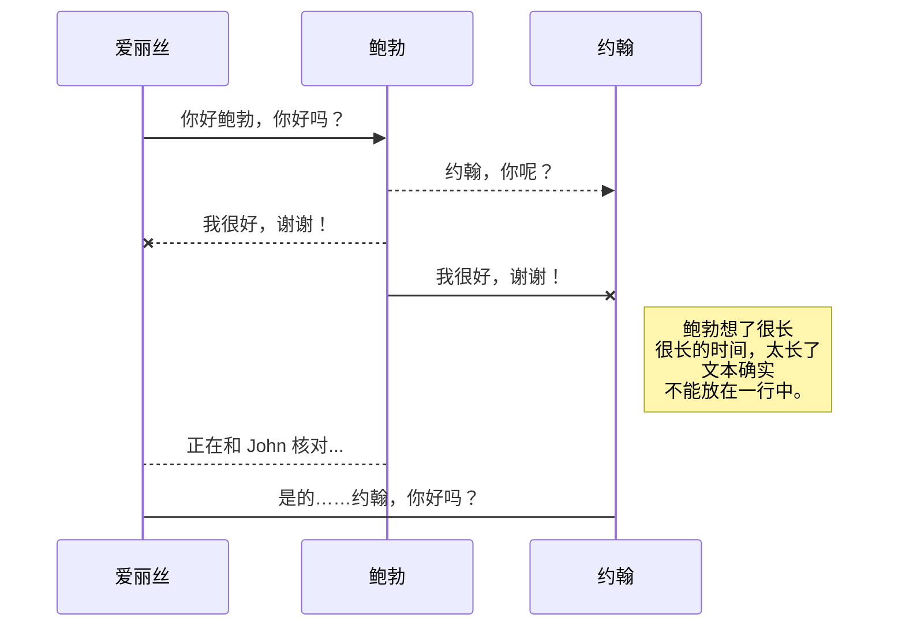
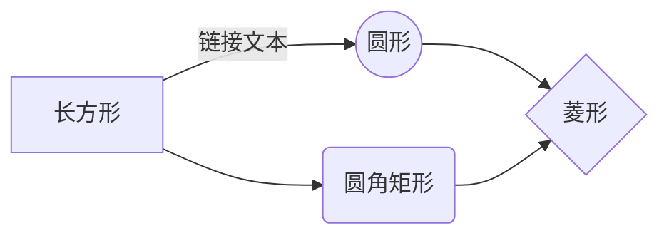

# Bitcoin源码分析

该文章对Bitcoin 0.21 版本进行粗略的开源代码分析，格式参见第五届开源代码创新大赛代码注解赛道。

## 主要程序

 1.   **Bitcoin Core.app** Bitcoin客户端图形界面
    
2.  **Bitcoind** /src/bitcoind Bitcoin命令行版,也是下一步源代码分析的重点(不能与Bitcoin Core同时运行）
    
3. **Bitcoin-cli** /src/bitcoin-cli Bitcoind的一个功能完备的RPC客户端，可以使用命令行查询某个区块信息，交易信息等等
    
4.  **Bitcoin-tx** /src/bitcoind Bitcoind的交易处理模块，可以进行交易的查询和创建

## 项目结构

首先根据Bitcoin的项目目录进行分析。
分成19个部分，每一个部分有各自的作用。

 1.  **bench**， 共识-法官判断
 2. **compact**， 兼容
 3. **config**， 配置
 4. **consensus**， 共识算法
 5. **crypto**， 加密解密
 6. **interfaces**， j事件，节点，钱包类
 7. **leveldb**，水平数据库
 8. **obj object**，cpp编译中间目录 
 9. **policy**， 策略
 10. **primitives**， 区块类，交易类
 11. **qt**， 图形界面类
 12. **rpc**， 通信
 13. **script**， 脚本
 14. **secp256k1**， 加密算法
 15. **support**，功能支持类
 16. **test**， 类的功能测试
 17. **univalue**，一致性 
 18. **wallet**， 钱包类
 19. **zmp**，通信信息 

 

接口可以分成三个部分：
 1. **WalletInitInterface.h**，钱包的抽象类接口 
 2. **validationinterface.h cpp**， 区块校验接口
 3. **ui_interface.h cpp**，图形界面的接口

 

运行模块分成四部分：
 1. **bitcoind**，bitcoin客户端核心模块 
 2. **bitcoin-cli**，RPC客户端 
 3. **bitcoin-tx**，交易处理模块
 4. **bitcoin-qt**，qt编写的图形化界面客户端 

 

运行模块分成四部分：

## BLOCK

区块是组成区块的基本单位，我们可以通过bitcoin-cli命令查看一个区块的基本信息。
在源代码中找一下区块的定义在primitives/block.h中:
### CBlockHeader

## 同步文件

一旦您的文件链接到同步位置，StackEdit中文版 将通过下载/上传任何修改来定期同步它。如有必要，将执行合并并解决冲突。

如果您刚刚修改了文件并且想要强制同步，请单击导航栏中的 **立即同步** 按钮。

> **注意：** 如果您没有要同步的文件，**立即同步**按钮将被禁用。

## 管理文件同步

由于一个文件可以与多个位置同步，您可以通过单击**同步**子菜单中的**文件同步**列出和管理同步位置。这允许您列出和删除链接到您的文件的同步位置。

# 发布

在 StackEdit中文版 中发布使您可以轻松地在线发布文件。对文件感到满意后，您可以将其发布到不同的托管平台，例如 **Blogger**、**Gitee**、**Gist**、**GitHub**、**WordPress** 和 **Zendesk**。使用 [Handlebars 模板](http://handlebarsjs.com/)，您可以完全控制导出的内容。

> 在开始发布之前，您必须在**发布**子菜单中链接一个账号。

## 发布文件

您可以通过打开 **发布** 子菜单并单击 **发布到** 来发布您的文件。对于某些位置，您可以选择以下格式：

- Markdown：在可以解释的网站上发布 Markdown 文本（例如**GitHub**），
- HTML：通过 Handlebars 模板发布转换为 HTML 的文件（例如在博客上）。

## 更新发布

发布后，StackEdit中文版 会将您的文件链接到该发布，这使您可以轻松地重新发布它。一旦您修改了文件并想要更新您的发布，请单击导航栏中的**立即发布**按钮。

> **注意：** 如果您没有要同步的文件，**立即同步**按钮将被禁用。

## 管理文件同步

由于一个文件可以与多个位置同步，您可以通过单击**同步**子菜单中的**文件同步**列出和管理同步位置。这允许您列出和删除链接到您的文件的同步位置。

# Markdown扩展

StackEdit中文版 通过添加额外的 **Markdown扩展** 扩展了标准 Markdown 语法，为您提供了一些不错的功能。

> **提示：** 您可以在 **文件属性** 对话框中禁用任何 **Markdown 扩展名**。

## SmartyPants

SmartyPants 将 ASCII 标点字符转换为“智能”印刷标点 HTML 实体。例如：

| |ASCII |HTML |
|----------------|--------------------------------| ------------------------------|
|单反引号|`'这不好玩吗？'` |'这不好玩吗？' |
|引用|`“这不好玩吗？”` |“这不好玩吗？” |
|破折号 |`-- 是破折号，--- 是破折号`|-- 是破折号，--- 是破折号|

## KaTeX

您可以使用 [KaTeX](https://khan.github.io/KaTeX/) 渲染 LaTeX 数学表达式：

满足 $\Gamma(n) = (n-1)!\quad\forall n\in\mathbb N$ 的 *Gamma 函数* 是通过欧拉积分

$$
\Gamma(z) = \int_0^\infty t^{z-1}e^{-t}dt\,.
$$

> 您可以在 [这里](http://meta.math.stackexchange.com/questions/5020/mathjax-basic-tutorial-and-quick-reference) 找到有关 **LaTeX** 数学表达式的更多信息。

## UML 图

您可以使用 [Mermaid](https://mermaidjs.github.io/) 渲染 UML 图。例如，这将产生一个序列图：

这将产生一个流程图：

<!--stackedit_data:
eyJoaXN0b3J5IjpbLTE5MDQzMjY1MzEsLTE5NjY1NjcwNjcsNz
I3NjYxOTY2LDE0MTc2MzUwOTksLTczNTM4OTU3MV19
-->